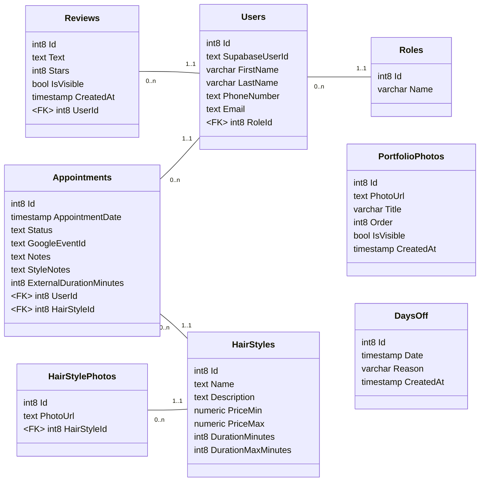

# Jenny Styliste — Full Stack Application

Online booking platform for a hair salon. Clients can book appointments, browse available hairstyles, leave reviews and view the portfolio. An admin dashboard allows managing appointments, photos, clients and days off.

**Live site: [https://jennystyliste.com](https://jennystyliste.com)**


---

## Project Structure

```
Jenny--hairdresser-s/
├── Hardressers-frontend/       # Next.js frontend
└── Hairdressers-backend/       # ASP.NET Core backend
    ├── Hairdressers-backend/   # Main API project
    │   ├── Controllers/        # API endpoints
    │   ├── Services/           # Business logic
    │   ├── Interfaces/         # Service contracts
    │   ├── Dtos/               # Data transfer objects
    │   └── Models/             # Domain models
    └── Hairdressers-backend.Tests/  # Unit tests
```

---

## Tech Stack

### Frontend — `Hardressers-frontend/`

| Technology | Usage |
|---|---|
| [Next.js 15](https://nextjs.org) (App Router) | React framework |
| [TypeScript](https://www.typescriptlang.org) | Type safety |
| [Tailwind CSS](https://tailwindcss.com) | Styling |
| [Supabase Auth](https://supabase.com/auth) | Authentication |
| [Axios](https://axios-http.com) | HTTP client |
| [Lucide React](https://lucide.dev) | Icons |
| Deployed on [Railway](https://railway.app) | Hosting |

### Backend — `Hairdressers-backend/`

| Technology | Usage |
|---|---|
| [ASP.NET Core](https://dotnet.microsoft.com) (.NET 8) | REST API |
| [Entity Framework Core](https://learn.microsoft.com/en-us/ef/core/) | ORM |
| [PostgreSQL](https://www.postgresql.org) via [Supabase](https://supabase.com) | Database |
| [Supabase Storage](https://supabase.com/storage) | Photo storage |
| JWT / Supabase Auth | Authorization |
| [Docker](https://www.docker.com) | Containerization |
| Deployed on [Railway](https://railway.app) | Hosting |

### Database

| Technology | Usage |
|---|---|
| [PostgreSQL](https://www.postgresql.org) | Relational database |
| Hosted on [Supabase](https://supabase.com) | Managed DB + Auth + Storage |



---

## Features

- **Online booking** — clients book appointments by selecting a hairstyle, date and time
- **Hairstyle catalog** — browse services with photos and pricing
- **Portfolio gallery** — photo gallery with lightbox preview
- **Reviews** — clients can leave reviews, admin can moderate visibility
- **Authentication** — sign up / login via Supabase Auth
- **Admin dashboard** — manage appointments, calendar, days off, photos, reviews and users
- **Trilingual** — French / English / Spanish

---

## Getting Started

### Prerequisites

- Node.js 18+
- .NET 8 SDK
- A Supabase project (PostgreSQL DB + Auth + Storage)

### Frontend

```bash
cd Hardressers-frontend
npm install
```

Create a `.env.local` file:

```env
NEXT_PUBLIC_SUPABASE_URL=your_supabase_url
NEXT_PUBLIC_SUPABASE_ANON_KEY=your_supabase_anon_key
NEXT_PUBLIC_API_URL=http://localhost:7226
```

```bash
npm run dev
```

### Backend

```bash
cd Hairdressers-backend
dotnet restore
dotnet run --project Hairdressers-backend
```

Configure `appsettings.json` with your Supabase connection string and credentials.

---

## Deployment

The Front is deployed in **Vercel** and the backend is deployed on **Railway**, with the database hosted on **Supabase**.

---

---

# Jenny Styliste — Application Full Stack (Français)

Plateforme de réservation en ligne pour un salon de coiffure. Les clients peuvent prendre rendez-vous, consulter les coiffures disponibles, laisser des avis et voir le portfolio. Un tableau de bord admin permet de gérer les rendez-vous, les photos, les clients et les congés.

**Site en production : [https://jennystyliste.com](https://jennystyliste.com)**


---

## Structure du projet

```
Jenny--hairdresser-s/
├── Hardressers-frontend/       # Frontend Next.js
└── Hairdressers-backend/       # Backend ASP.NET Core
    ├── Hairdressers-backend/   # Projet API principal
    │   ├── Controllers/        # Endpoints API
    │   ├── Services/           # Logique métier
    │   ├── Interfaces/         # Contrats de services
    │   ├── Dtos/               # Objets de transfert de données
    │   └── Models/             # Modèles du domaine
    └── Hairdressers-backend.Tests/  # Tests unitaires
```

---

## Stack technique

### Frontend — `Hardressers-frontend/`

| Technologie | Utilisation |
|---|---|
| [Next.js 15](https://nextjs.org) (App Router) | Framework React |
| [TypeScript](https://www.typescriptlang.org) | Typage statique |
| [Tailwind CSS](https://tailwindcss.com) | Styles |
| [Supabase Auth](https://supabase.com/auth) | Authentification |
| [Axios](https://axios-http.com) | Client HTTP |
| [Lucide React](https://lucide.dev) | Icônes |
| Deploye sur [Railway](https://railway.app) | Hebergement |

### Backend — `Hairdressers-backend/`

| Technologie | Utilisation |
|---|---|
| [ASP.NET Core](https://dotnet.microsoft.com) (.NET 8) | API REST |
| [Entity Framework Core](https://learn.microsoft.com/en-us/ef/core/) | ORM |
| [PostgreSQL](https://www.postgresql.org) via [Supabase](https://supabase.com) | Base de donnees |
| [Supabase Storage](https://supabase.com/storage) | Stockage des photos |
| JWT / Supabase Auth | Autorisation |
| [Docker](https://www.docker.com) | Conteneurisation |
| Deploye sur [Railway](https://railway.app) | Hebergement |

### Base de donnees

| Technologie | Utilisation |
|---|---|
| [PostgreSQL](https://www.postgresql.org) | Base de donnees relationnelle |
| Hebergee sur [Supabase](https://supabase.com) | DB + Auth + Stockage manages |


---

## Fonctionnalites

- **Reservation en ligne** — les clients reservent en choisissant une coiffure, une date et un creneau
- **Catalogue de coiffures** — consultation des services avec photos et prix
- **Galerie portfolio** — galerie photo avec apercu en lightbox
- **Avis clients** — les clients peuvent laisser des avis, l'admin gere la visibilite
- **Authentification** — inscription / connexion via Supabase Auth
- **Tableau de bord admin** — gestion des rendez-vous, calendrier, conges, photos, avis et utilisateurs
- **Trilingue** — Francais / Anglais / Espagnol

---

## Demarrer le projet

### Prerequis

- Node.js 18+
- .NET 8 SDK
- Un projet Supabase (PostgreSQL DB + Auth + Storage)

### Frontend

```bash
cd Hardressers-frontend
npm install
```

Cree un fichier `.env.local` :

```env
NEXT_PUBLIC_SUPABASE_URL=your_supabase_url
NEXT_PUBLIC_SUPABASE_ANON_KEY=your_supabase_anon_key
NEXT_PUBLIC_API_URL=http://localhost:7226
```

```bash
npm run dev
```

### Backend

```bash
cd Hairdressers-backend
dotnet restore
dotnet run --project Hairdressers-backend
```

Configure `appsettings.json` avec ta chaine de connexion Supabase et tes credentials.

---

## Deploiement

Le frontend est deployé sur **Versel** et le backend deployé sur **Railway**, avec la base de donnees hebergée sur **Supabase**.
